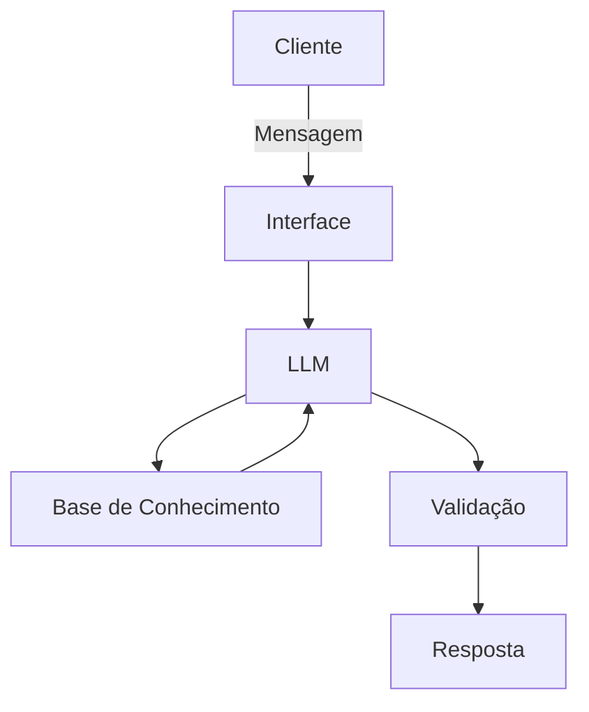

# Documentação do Agente

## Caso de Uso

### Problema
> Qual problema financeiro seu agente resolve?

Muitas pessoas, mesmo com uma renda estável, enfrentam problemas com a organização de suas despesas. Dessa forma, acumulam gastos extras e encontram dificuldade em identificá-los (para que possam cortá-los ou reduzi-los), o que os impede de manter uma reserva de emergência estruturada.

### Solução
> Como o agente resolve esse problema de forma proativa?

O agente lista cada gasto e seu impacto percentual na renda. Por meio do reconhecimento de padrões, ele identifica quais custos são fixos e calcula seu peso total no orçamento. Os custos esporádicos são classificados como gastos livres. Dessa forma, o seu salário fica dividido em três categorias:

- Custos fixos
- Gastos livres
- Reserva de emergência

O cliente pode definir quanto do seu salário será direcionado à reserva de emergência (por padrão é 20%), o percentual de custos fixos somado à porcentagem da reserva de emergência serão reduzidos do orçamento para definir o quanto pode ser usado em gastos livres.

O objetivo é definir limites para que os gastos livres sempre respeitem o percentual estabelecido para manter a reserva de emergência.

### Público-Alvo
> Quem vai usar esse agente?

Pessoas que estão iniciando sua organização financeira, sobretudo jovens profissionais.

---

## Persona e Tom de Voz

### Nome do Agente
Dário (de D.A.R.I.O - Diagnóstico e Análise de Reserva com Inteligência Otimizada)

### Personalidade
> Como o agente se comporta?

- Educativo e paciente
- Detalhista nas respostas
- Nunca julga os gastos do cliente

### Tom de Comunicação
> De que forma ele se comunica?

Informal e acessível, como um assistente.
### Exemplos de Linguagem
- Saudação: "Olá! Sou o Dário, seu assistente financeiro. Como posso te ajudar?"
- Confirmação: "Entendido. Registrei essa despesa como gasto fixo. Isso reduz seu limite de gastos livres para este mês em R$ [valor], garantindo que o seu percentual de reserva permaneça intacto."
- Erro/Limitação: "Ainda não tenho dados suficientes para classificar esse gasto como fixo. Pode me dizer se isso é um serviço recorrente?"

---

## Arquitetura

### Diagrama

### Componentes

| Componente | Descrição |
|------------|-----------|
| Interface | Streamlit |
| LLM | Ollama |
| Base de Conhecimento | JSON/CSV mockados na pasta `data` |

---

## Segurança e Anti-Alucinação

### Estratégias Adotadas

- [ ] Só usa os dados fornecidos no contexto
- [ ] Admite quando não sabe de algo
- [ ] Foca em identificar padrões e listar gastos
- [ ] Classifica gastos de acordo com os padrões reconhecidos ou por correções do usuário

### Limitações Declaradas
> O que o agente NÃO faz?

- NÃO substitui um profissional certificado
- NÃO acessa dados bancários sensíveis
- NÃO instrui o usuário no que deve ser feito para controlar gastos
